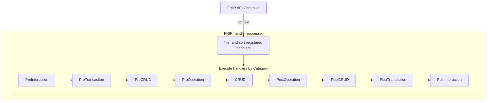

```mermaid
flowchart TD
    controller[FHIR API Controller] -->|context| pre(filter and sort registered handlers)
    subgraph processor[FHIR handler processor]
        pre -->execute[Execute handlers by Category]
        subgraph execute[Execute handlers by Category]
        PreInteraction --> PreTransaction
        PreTransaction --> PreCRUD
        PreCRUD --> PreOperation
        PreOperation --> CRUD
        CRUD --> PostOperation
        PostOperation --> PostCRUD
        PostCRUD --> PostTransaction
        PostTransaction --> PostInteraction
        end
    end

```
